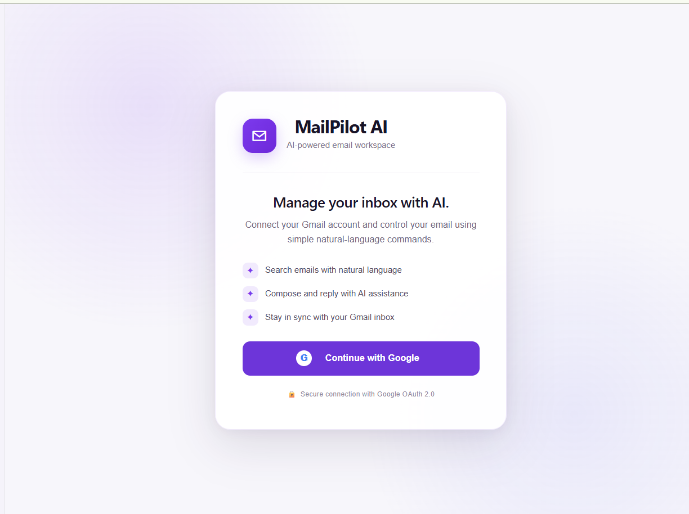
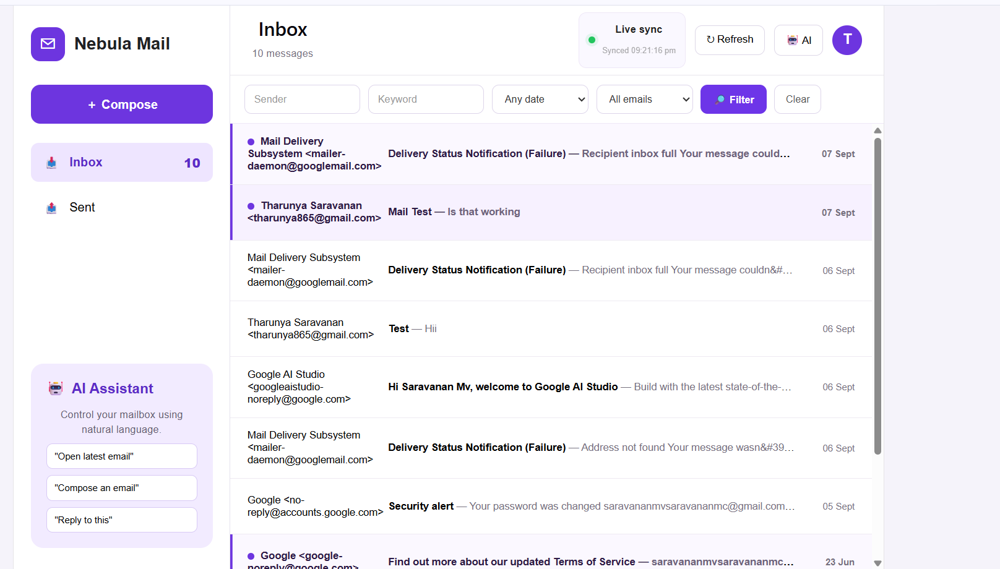
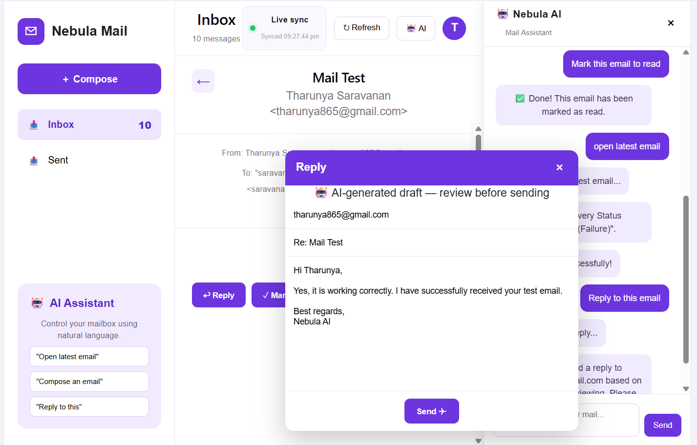
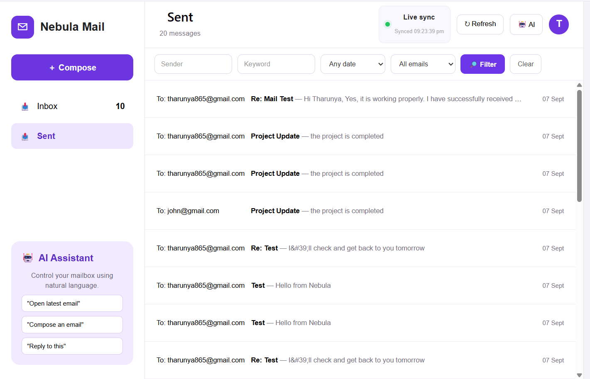
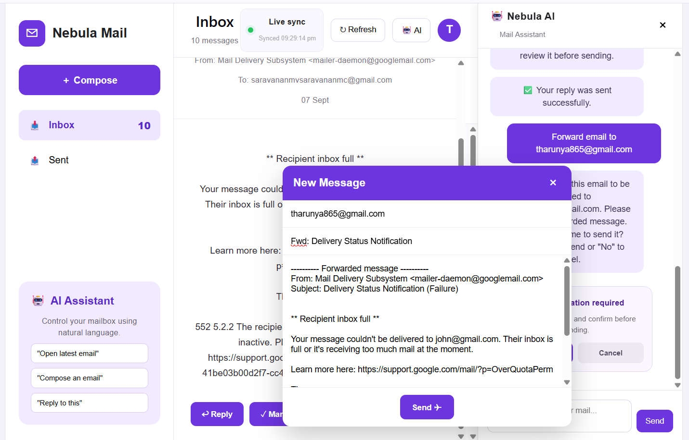
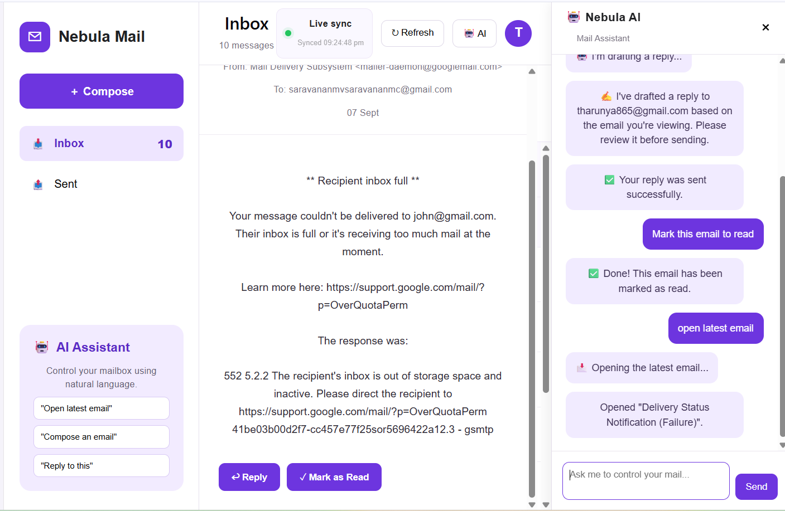

**MailPilot AI**

MailPilot AI is an AI-powered Gmail web application where users can control their email using natural-language commands.
The application integrates with Gmail using Google OAuth 2.0 and Gmail API, while the AI assistant controls the application UI for actions such as searching, opening, composing, replying, forwarding, and managing emails.

**Features**
- Gmail OAuth 2.0 authentication
- Real Inbox and Sent emails
- Natural-language email search
- AI-controlled compose and reply
- Context-aware email actions
- Open latest email
- Mark emails as read/unread
- Delete and forward emails
- Automatic inbox synchronization

**Setup & Run Locally**

**1. Clone the repository**
```bash
git clone https://github.com/Tharunya16/mailpilot-ai
cd mailpilot-ai
```
**2. Backend**
```bash
cd backend
npm install
```
Create `backend/.env`:

```env
PORT=5000
GOOGLE_CLIENT_ID=YOUR_GOOGLE_CLIENT_ID
GOOGLE_CLIENT_SECRET=YOUR_GOOGLE_CLIENT_SECRET
GOOGLE_REDIRECT_URI=http://localhost:5000/auth/google/callback
SESSION_SECRET=YOUR_SESSION_SECRET
GEMINI_API_KEY=YOUR_GEMINI_API_KEY
```
Start the backend:

```bash
node server.js
```
**3. Frontend**

Open another terminal:
```bash
cd frontend
npm install
npm run dev
```
- Open:
http://localhost:5173
- Google OAuth redirect URI:
http://localhost:5000/auth/google/callback

**Architecture Decisions & Trade-offs**

- **React + Vite** — used for a responsive UI and easy state management.
- **Node.js + Express** — handles Gmail API operations and keeps OAuth credentials on the backend.
- **Gmail API** — provides real Inbox, Sent, search, send, reply, and email-management functionality.
- **Gemini AI** — interprets natural-language commands and generates contextual replies.
- **Hybrid AI approach** — common commands such as search, open, reply, and mark read/unread are handled deterministically for reliability, while flexible requests can use the AI layer.
- **15-second polling** — used for automatic mailbox synchronization within the project timeframe. A production version would use Gmail Push Notifications with Google Cloud Pub/Sub.

**Screenshots**

These are some screenshots in our application that shows the AI assistant controlling the UI:

**Login**


**Inbox**



**AI Reply**



**Sent Email**



**Forward Email**



**Latest Email**



**What I Would Improve With More Time**

1. Replace polling with Gmail Push Notifications / Pub/Sub
2. Add full Gmail-style conversation threads
3. Improve multi-step AI commands
4. Add automated unit and end-to-end tests
5. Add production deployment with HTTPS and secure cookies
6. Improve AI validation and confirmation for destructive actions

**Tech Stack**

- **Frontend:** React, Vite, JavaScript, CSS
- **Backend:** Node.js, Express.js, Gmail API, Google OAuth 2.0
- **AI:** Gemini API


